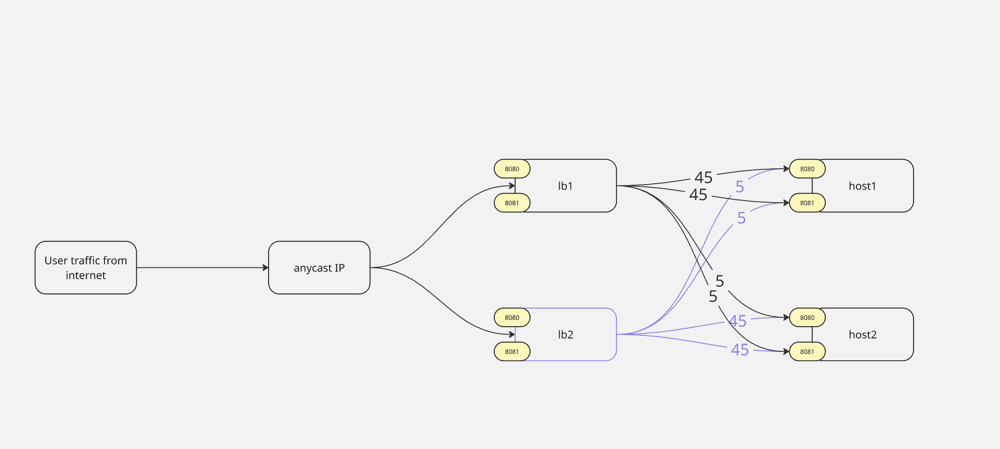

## HW10

Общая схема создаваемых ресурсов


Перед запуском нужно:
1. Установить следующие переменные окружения
    ```bash
    export TF_VAR_provider_username="<username>"
    export TF_VAR_provider_password="<password>"
    export TF_VAR_provider_project="<project_id>"
    export TF_VAR_provider_auth_url="<provider_auth_url>"
    export TF_VAR_provider_region="<provider_region>" # опционально, по умолчанию "RegionOne"
    export TF_VAR_availability_zone="<availability_zone>" # опционально, по умолчанию "GZ1"
    export TF_VAR_availability_zone_2="<availability_zone>" # опционально, по умолчанию "MS1"
    export TF_VAR_stand_name="<stand_name>" # опционально, по умолчанию "test"
    export TF_VAR_private_subnet="<private_subnet>" # опционально, по умолчанию "192.168.1.0/24"
    export TF_VAR_compute_count="<compute_count>" # опционально, по умолчанию "2"
    ```
2. Проинициализировать terraform-провайдер
   ```bash
   terraform init
   ```
3. Провалидировать конфигурацию
   ```bash
   terraform validate
   ```
4. Посмотреть план применяемых изменений
   ```bash
   terraform plan
   ```
5. Применить изменения
  ```bash
  terraform apply
  ```
  Получить созданный private_key для инстансов
  ```bash
  terraform output -raw private_key
  ```
6. Удалить созданный ресурсы можно следующим образом
  ```bash
  terraform destroy
  ```
